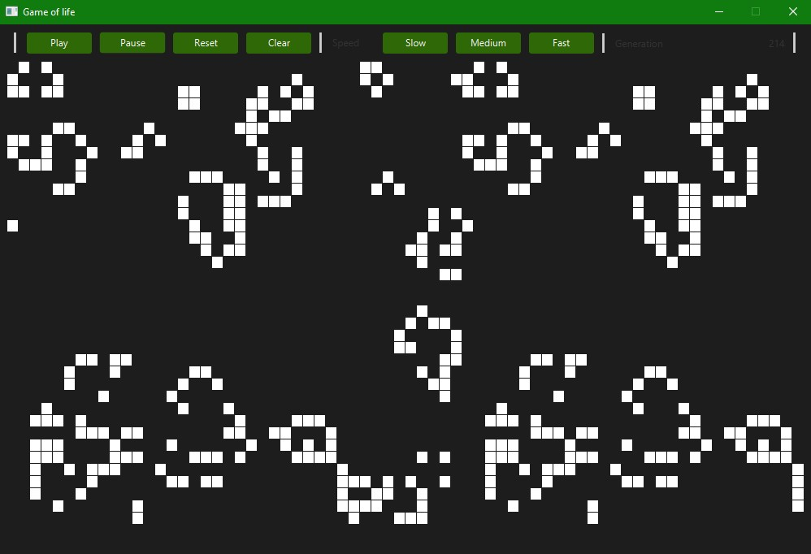

# Game of life

Project is implementation of [Conway's Game of Life](https://en.wikipedia.org/wiki/Conway%27s_Game_of_Life) implementation with logic written in Java and graphic visualization in JavaFX.
## Requirements

* Java 11
* JavaFX

## Sample frames
